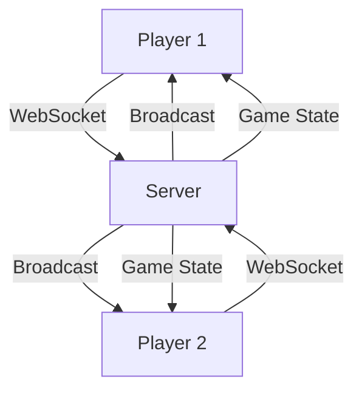

# 🎮 Tank Battle Multiplayer

<div align="center">


**A real-time multiplayer tank battle game built with React, Node.js, and WebSockets**

[🚀 Live Demo](#) • [📖 Documentation](#features) • [🛠️ Installation](#installation) • [🎯 How to Play](#how-to-play)


</div>

---
[](https://www.youtube.com/watch?v=pXa9K9sVI0o)

## 🌟 Features

### 🎯 **Core Gameplay**
- **Real-time Multiplayer Battles** - Face off against opponents in intense tank warfare
- **Dynamic Terrain System** - Procedurally generated landscapes for strategic gameplay
- **Multiple Weapons** - Choose from Cannon, Missile, Napalm, and Laser with unique damage values
- **Physics-based Projectiles** - Realistic trajectory simulation with gravity effects
- **Health System** - Strategic gameplay with health bars and damage tracking

### 🎮 **Game Mechanics**
- **Turn-based Combat** - Strategic gameplay with alternating turns
- **Tank Movement** - Use A/D keys to position your tank strategically
- **Drag-to-Aim System** - Intuitive mouse-based aiming with power and angle control
- **Real-time Synchronization** - Seamless multiplayer experience with WebSocket communication
- **Game State Management** - Robust server-side game logic and client synchronization

### 🎨 **Visual Features**
- **Canvas-based Rendering** - Smooth 60fps gameplay with HTML5 Canvas
- **Dynamic Visual Effects** - Projectile trails, power indicators, and turn indicators
- **Responsive UI** - Modern interface with real-time game status updates
- **Color-coded Weapons** - Visual distinction between different weapon types
- **Health Bar Visualization** - Real-time health display with color-coded status

### 🔧 **Technical Features**
- **WebSocket Communication** - Real-time bidirectional communication
- **Server-side Physics** - Accurate projectile simulation and collision detection
- **Client-side Preview** - Real-time trajectory prediction for aiming
- **Auto-reconnection** - Robust connection handling with automatic reconnection
- **Cross-platform** - Works on any modern web browser

---

## 🛠️ Installation

### Prerequisites
- **Node.js** (v18 or higher)
- **npm** or **yarn**

### Quick Start

1. **Clone the repository**
   ```bash
   git clone https://github.com/yourusername/tank-battle-multiplayer.git
   cd tank-battle-multiplayer
   ```

2. **Install dependencies**
   ```bash
   # Install server dependencies
   cd server
   npm install

   # Install client dependencies
   cd ../vite-project
   npm install
   ```

3. **Start the development servers**
   ```bash
   # Start the main server (includes both WebSocket and Vite)
   cd ../server
   npm start
   ```

4. **Open your browser**
   - Navigate to `http://localhost:5173`
   - The WebSocket server will run on port `3001`

### Alternative Setup

If you prefer to run servers separately:

```bash
# Terminal 1 - WebSocket Server
cd ser
npm run server

# Terminal 2 - Vite Development Server
cd vite-project
npm run dev
```

---

## 🎯 How to Play

### 🎮 **Getting Started**
1. **Create or Join a Game**
   - Click "Create New Game" to start a new battle
   - Share the game code with your opponent
   - Or join an existing game using the provided code

2. **Game Setup**
   - Wait for your opponent to join
   - Choose your weapon from the weapon selector
   - Position your tank using A/D keys

### 🎯 **Combat Mechanics**
1. **Aiming System**
   - Click and drag from your tank to aim
   - Drag distance determines power (0-100%)
   - Drag direction determines angle
   - Preview trajectory shows where your shot will land

2. **Firing**
   - Release mouse button to fire
   - Watch the projectile animation
   - Wait for server to calculate hit/miss
   - Turn switches to opponent

3. **Strategy**
   - Use terrain to your advantage
   - Position tanks strategically
   - Choose weapons based on situation
   - Monitor opponent's health

### 🏆 **Victory Conditions**
- **Eliminate Opponent** - Reduce opponent's health to 0
- **Strategic Positioning** - Use terrain and positioning advantageously
- **Weapon Selection** - Choose the right weapon for each situation

---

## 🏗️ Architecture

### 📁 **Project Structure**
```
tank-battle-multiplayer/
├── server/                    # Backend server
│   ├── server.js          # WebSocket server & game logic
│   └── package.json       # Server dependencies
├── vite-project/          # Frontend application
│   ├── src/
│   │   ├── components/
│   │   │   ├── GameCanvas.jsx      # Main game rendering
│   │   │   ├── MultiplayerClient.jsx # WebSocket client
│   │   │   └── WeaponSelector.jsx  # Weapon selection UI
│   │   ├── App.jsx        # Main application component
│   │   └── main.tsx       # Application entry point
│   └── package.json       # Client dependencies
└── README.md              # This file
```

### 🔌 **Technology Stack**

#### **Frontend**
- **React 18** - Modern UI framework with hooks
- **Vite** - Fast build tool and development server
- **HTML5 Canvas** - High-performance game rendering
- **WebSocket API** - Real-time communication

#### **Backend**
- **Node.js** - Server runtime environment
- **ws** - WebSocket library for real-time communication
- **HTTP Server** - Web server for serving the application

### 🌐 **Communication Flow**



---

## 🎨 **Game Features in Detail**

### 🎯 **Weapon System**
| Weapon | Damage | Color | Special Effects |
|--------|--------|-------|-----------------|
| **Cannon** | 25 | 🔴 Red | Standard projectile |
| **Missile** | 40 | 🟠 Orange | High damage |
| **Napalm** | 35 | 🟣 Magenta | Area damage |
| **Laser** | 50 | 🔵 Cyan | Maximum damage |

### 🗺️ **Terrain System**
- **Procedural Generation** - Unique terrain for each game
- **Sinusoidal Base** - Natural-looking landscapes
- **Random Variation** - Adds unpredictability to gameplay
- **Collision Detection** - Realistic projectile-terrain interaction

### 🎮 **Controls**
| Action | Control | Description |
|--------|---------|-------------|
| **Move Left** | `A` Key | Move tank left |
| **Move Right** | `D` Key | Move tank right |
| **Aim & Fire** | Mouse Drag | Click and drag to aim, release to fire |
| **Weapon Select** | UI Buttons | Click weapon buttons to change |

---

## 🚀 **Development**

### 🔧 **Available Scripts**

#### **Server (ser/)**
```bash
node server.js          # Start both WebSocket and Vite servers

```

#### **Client (vite-project/)**
```bash
npm run dev        # Start development server
npm run build      # Build for production
npm run preview    # Preview production build
```

### 🐛 **Debugging**

The application includes comprehensive logging:

- **Server Logs** - WebSocket connections, game events, broadcasting
- **Client Logs** - Message reception, state updates, projectile animation
- **Game State** - Real-time synchronization debugging

### 🔄 **Real-time Features**

- **Live Game State** - All players see synchronized game state
- **Instant Updates** - Projectile animations, health changes, turn switching
- **Connection Recovery** - Automatic reconnection on network issues
- **Broadcast System** - Efficient message distribution to all players

---

## 🤝 **Contributing**

We welcome contributions! Here's how you can help:

### 🐛 **Bug Reports**
- Use the GitHub issue tracker
- Include detailed reproduction steps
- Provide browser/OS information

### 💡 **Feature Requests**
- Open a feature request issue
- Describe the desired functionality
- Explain the use case

### 🔧 **Code Contributions**
1. Fork the repository
2. Create a feature branch
3. Make your changes
4. Add tests if applicable
5. Submit a pull request

### 📋 **Development Guidelines**
- Follow existing code style
- Add comments for complex logic
- Test multiplayer functionality
- Ensure cross-browser compatibility


## 🙏 **Acknowledgments**

- **React Team** - For the amazing framework
- **Vite Team** - For the fast build tool
- **WebSocket Community** - For real-time communication standards
- **Canvas API** - For high-performance rendering

---

## 📞 **Support**

- **Issues** - [GitHub Issues](https://github.com/NGU-152002/tank-battle-multiplayer/issues)
- **Discussions** - [GitHub Discussions](https://github.com/NGU-152002/tank-battle-multiplayer/discussions)
- **Email** - jayakrishna152002@gmail.com

---

<div align="center">

**Made with ❤️ by Jayakrishna Akki**

[⭐ Star this repo](https://github.com/NGU-152002/tank-battle-multiplayer) • [🔄 Fork this repo](https://github.com/NGU-152002/tank-battle-multiplayer/fork)

</div> 
